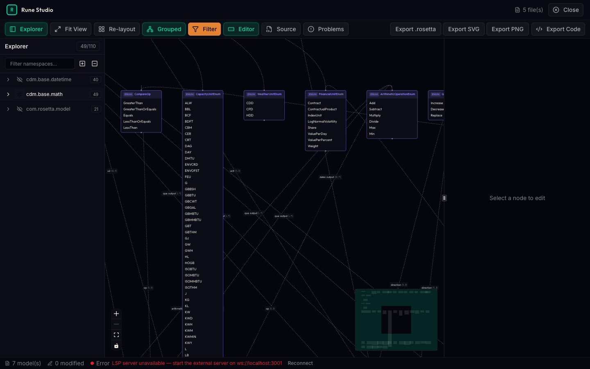

# Rune Studio

[](https://github.com/pradeepmouli/rune-langium/actions/workflows/ci.yml)
[](LICENSE)
[](LICENSE)
[](https://www.typescriptlang.org/)
[](https://react.dev/)

Web-native tooling for the [Rune DSL](https://github.com/finos/rune-dsl) — explore, edit, and validate CDM models and DRR reporting logic right in your browser. No Eclipse. No Java. No setup.

<p align="center">
  
</p>

> **⚠️ Pre-1.0 software** — APIs are subject to change between minor versions. Pin to exact versions in production. See the [CHANGELOG](./CHANGELOG.md) for breaking changes between releases.

📚 **Documentation:** <https://pradeepmouli.github.io/rune-langium/>

## Features

- **Built on Langium** — pure TypeScript language server, runs anywhere JavaScript runs
- **Full LSP support** — autocomplete, validation, go-to-definition, hover, diagnostics
- **CDM & DRR out of the box** — load and explore ISDA Common Domain Model and Digital Regulatory Reporting models
- **Three-panel IDE** — visual graph navigation, structured form editing, and full code editor, all synchronized
- **Embeddable** — Monaco editor + web worker language server = drop-in component for any web app

## Getting Started

### Prerequisites

- Node.js >= 20.0.0
- pnpm >= 10.0.0

### Installation

```bash
git clone https://github.com/pradeepmouli/rune-langium.git
cd rune-langium
pnpm install
```

> **Note on Local Dependencies**: This project currently uses local `link:` overrides for `@lspeasy/*` packages in `pnpm-workspace.yaml` and `package.json`. These require a sibling `../lspy` directory to be present during installation. If you're not working on LSP features:
>
> 1. Comment out the `overrides:` section in `pnpm-workspace.yaml`
> 2. Remove the `@lspeasy/*` dependencies from root `package.json`
> 3. Run `pnpm install` again
>
> For contributors working on LSP features, ensure the `lspy` repository is cloned as a sibling directory to this repo.

### Development

```bash
# Start development
pnpm run dev

# Run tests
pnpm run test

# Lint and format
pnpm run lint
pnpm run format
```

### Fixture Snapshots

Integration tests and Studio scenarios rely on vendored `.rosetta` fixtures under `.resources/`.

```bash
# Refresh all vendored fixtures (CDM + Rune DSL + Rune FpML)
bash scripts/update-fixtures.sh

# Override refs when needed
bash scripts/update-fixtures.sh --cdm-tag 7.0.0-dev.83 --rune-tag 9.76.2 --fpml-tag master
```

This populates:

- `.resources/cdm`
- `.resources/rune-dsl`
- `.resources/rune-fpml`

## Project Structure

```
rune-langium/
├── apps/studio/          # Rune Studio web application
├── packages/
│   ├── core/             # Parser, AST types, language infrastructure
│   ├── visual-editor/    # React Flow graph editor component
│   ├── design-system/    # Theme, tokens, UI primitives
│   ├── lsp-server/       # Language server (LSP)
│   ├── cli/              # Command-line interface
│   └── codegen/          # Code generation tools
├── site/                 # Landing page (GitHub Pages)
└── docs/                 # Documentation
```

## Documentation

- [Workspace Guide](docs/WORKSPACE.md) — managing packages
- [Development Workflow](docs/DEVELOPMENT.md) — development process
- [Testing Guide](docs/TESTING.md) — testing setup
- [Examples](docs/EXAMPLES.md) — usage examples

## Contributing

Please see [CONTRIBUTING.md](CONTRIBUTING.md) for guidelines.

## License

This project uses a split licensing model:

- **Core packages** (`packages/`) — [MIT License](./LICENSE)
- **Rune Studio** (`apps/studio/`) — [FSL-1.1-ALv2](./apps/studio/LICENSE) (Functional Source License v1.1, Apache 2.0 Future License)

The FSL allows you to use, copy, modify, and redistribute the Studio source code for any purpose **except** offering a commercial product that competes with Rune Studio. Under FSL-1.1-ALv2, each release is scheduled to convert to Apache 2.0 after a delay (typically two years); the authoritative conversion date for any given release is the `Change Date` specified in `apps/studio/LICENSE` for that release (which may differ between tags).

The core grammar, language server, and library packages are and will remain MIT-licensed.

See [NOTICE](./NOTICE) for third-party attribution.

---

ISDA® is a registered trademark of the International Swaps and Derivatives Association, Inc. CDM is hosted by FINOS under the Community Specification License. Rune Studio is not affiliated with or endorsed by ISDA or FINOS.

---

**Author**: [Pradeep Mouli](https://github.com/pradeepmouli)
