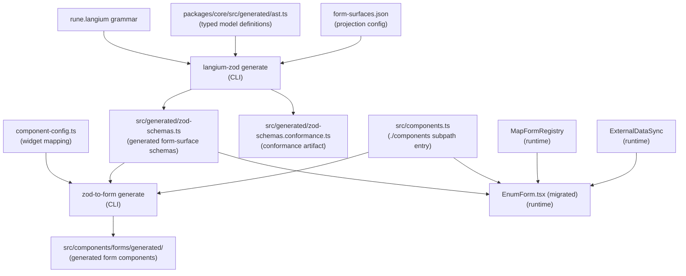

# Data Model: Adopt generated form surfaces and zod-form runtime

**Feature**: 006-adopt-zod-to-form
**Date**: 2026-02-28
**Phase**: 1 — Entities and relationships

---

## Overview

This feature introduces no persistent data store. All entities are either:
- **Configuration inputs** (authored by developers, committed to source)
- **Generated artifacts** (committed, regenerated deterministically from inputs)
- **Runtime TypeScript types** (compile-time contracts)

The diagram below shows the data flow from inputs to generated outputs to runtime.



---

## Entity 1: Form Projection Config (`form-surfaces.json`)

**Location**: `packages/visual-editor/form-surfaces.json`
**Kind**: Developer-authored, committed configuration input
**Consumed by**: `langium-zod generate --projection`

| Field | Type | Description |
|---|---|---|
| `defaults.strip` | `string[]` | Langium internal fields to exclude from all generated schemas |
| `types` | `Record<string, TypeProjection>` | Per-grammar-type field selections |
| `types[K].fields` | `string[]` | Field names from the grammar type to include in generated schema |

**Validation**: Validated at `langium-zod generate` time — unknown field names in `types[K].fields` cause a generation error.

**Example content** (from `rune-langium-adopt.md`):
```json
{
  "defaults": {
    "strip": ["$container", "$document", "$cstNode", "$containerProperty", "$containerIndex"]
  },
  "types": {
    "RosettaEnumeration": { "fields": ["name", "superEnum", "enumValues"] },
    "Data":               { "fields": ["name", "superType", "description", "attributes"] },
    "Attribute":          { "fields": ["name", "typeCall", "card"] },
    "RosettaFunction":    { "fields": ["name", "outputType", "parameters"] },
    "ChoiceType":         { "fields": ["name", "superType", "options"] }
  }
}
```

**State transitions**: None — static config. Regenerate schemas when modified.

---

## Entity 2: Generated Form-Surface Schemas (`zod-schemas.ts`)

**Location**: `packages/visual-editor/src/generated/zod-schemas.ts`
**Kind**: Generated artifact, committed
**Produced by**: `langium-zod generate`
**Consumed by**: `zod-to-form generate` (scaffold), `EnumForm.tsx` (runtime)

| Export | Type | Description |
|---|---|---|
| `RosettaEnumerationSchema` | `ZodObject` | Static base schema for Enum form |
| `RosettaEnumerationSchemaRefs` | `interface` | Cross-ref validation input shape |
| `createRosettaEnumerationSchema` | `(refs) => ZodObject` | Factory with `.refine()` on cross-ref fields |
| `DataSchema` | `ZodObject` | Static base schema for Data type form |
| `createDataSchema` | `(refs) => ZodObject` | Factory for Data type cross-ref validation |
| *(similar pattern for Attribute, RosettaFunction, ChoiceType)* | | |

**Conformance constraints**: Every schema field must exist on the corresponding `TypeNodeData` interface with an assignable type. Verified by `zod-schemas.conformance.ts` at compile time.

**Stale detection**: CI runs `pnpm generate:schemas` and asserts `git diff --exit-code`.

---

## Entity 3: Conformance Artifact (`zod-schemas.conformance.ts`)

**Location**: `packages/visual-editor/src/generated/zod-schemas.conformance.ts`
**Kind**: Generated artifact, committed
**Produced by**: `langium-zod generate --conformance --ast-types src/generated/ast.ts`
**Consumed by**: TypeScript compiler only (not imported at runtime)

Contains bidirectional assignability type assertions. If any generated schema field drifts from `ast.ts`, `tsc --noEmit` fails with a type error.

**Validation rule**: `_Check = SchemaType extends Pick<AstType, keyof SchemaType> ? true : never`
If `_Check` resolves to `never`, tsc reports a compile error.

---

## Entity 4: Component Mapping Config (`component-config.ts`)

**Location**: `packages/visual-editor/component-config.ts`
**Kind**: Developer-authored TypeScript, committed
**Consumed by**: `zod-to-form generate --component-config` (scaffold), `ZodForm` at runtime

| Field | Type | Description |
|---|---|---|
| `components` | `string` | Module path for the widget component barrel (`@rune-langium/visual-editor/components`) |
| `fieldTypes` | `Record<string, { component: keyof VisualModule }>` | Abstract field type → widget name |
| `fields` | `Record<string, { fieldType: string; props?: object }>` | Schema field path → field type override |

**Type constraint**: Typed via `satisfies ZodToFormComponentConfig<VisualModule>` where `VisualModule = typeof import('@rune-langium/visual-editor/components')`. Invalid widget names produce a TypeScript compile error (FR-008).

**Field path convention**: `{schemaVariableName}.{fieldPath}` — e.g., `enumForm.parentName`.

---

## Entity 5: Component Subpath Entry (`components.ts`)

**Location**: `packages/visual-editor/src/components.ts`
**Kind**: New developer-authored barrel, committed
**Exposes**: `TypeSelector`, `CardinalityPicker`
**Referenced by**: `component-config.ts` (type import), `@zod-to-form/react` renderer (runtime import)

| Export | Source | Widget purpose |
|---|---|---|
| `TypeSelector` | `./components/editors/TypeSelector.js` | Cross-reference field picker |
| `CardinalityPicker` | `./components/editors/CardinalityPicker.js` | Cardinality field picker |

**Lifecycle**: Present at runtime (both ESM import and type-level `typeof import(...)` work).

---

## Entity 6: Generated Form Components

**Location**: `packages/visual-editor/src/components/forms/generated/`
**Kind**: Generated artifact, committed
**Produced by**: `zod-to-form generate`

| File | Produced from | Auto-save | Custom widgets |
|---|---|---|---|
| `RosettaEnumerationForm.tsx` | `RosettaEnumerationSchema`, component-config | yes (onValueChange) | TypeSelector for superEnum |
| `DataForm.tsx` | `DataSchema`, component-config | yes | TypeSelector for superType, CardinalityPicker for attributes |

Generated components:
- Accept `onValueChange?: (values: T) => void` prop (no submit button)
- Import custom widgets from `@rune-langium/visual-editor/components`
- Use `ZodForm` from `@zod-to-form/react` internally

**Stale detection**: CI `git diff --exit-code` after `pnpm scaffold:forms`.

---

## Entity 7: `MapFormRegistry`

**Location**: `packages/visual-editor/src/components/forms/MapFormRegistry.ts`
**Kind**: New shared utility, committed
**Consumed by**: `EnumForm.tsx` (migrated), future form migrations

| Method | Signature | Description |
|---|---|---|
| `add` | `(schema: ZodType, meta: FormMeta) => this` | Register field-level render override |
| `get` | `(schema: ZodType) => FormMeta \| undefined` | Retrieve override by schema shape |
| `has` | `(schema: ZodType) => boolean` | Check if override registered |

Implements `ZodFormRegistry` interface from `@zod-to-form/core`.

---

## Entity 8: `ExternalDataSync`

**Location**: `packages/visual-editor/src/components/forms/ExternalDataSync.tsx`
**Kind**: New shared utility component, committed
**Consumed by**: `EnumForm.tsx` (migrated), future form migrations

| Prop | Type | Description |
|---|---|---|
| `data` | `unknown` | The upstream data object (reference-equality tracked) |
| `toValues` | `() => T` | Maps upstream data to form default values |

**Behavior**: On reference change of `data`, calls `form.reset(toValues(), { keepDirtyValues: true })`. This satisfies FR-016: pristine fields update, dirty fields are preserved.

**Lifecycle**: Must be rendered inside a `ZodForm` (which provides `FormProvider`).

---

## Entity 9: Migrated `EnumForm`

**Location**: `packages/visual-editor/src/components/editors/EnumForm.tsx`
**Kind**: Existing file — internal implementation modified, public interface unchanged

**Unchanged** (public contract preserved):
```typescript
interface EnumFormProps {
  nodeId: string;
  data: TypeNodeData<'enum'>;
  availableTypes: TypeOption[];
  actions: EditorFormActions<'enum'>;
  inheritedGroups?: InheritedGroup[];
}
```

**Changed** (internal only):
- `useNodeForm` + `FormProvider` + `Controller` replaced by `ZodForm`
- Schema narrowed to `{ name, superEnum }` (auto-save fields only)
- `ExternalDataSync` child handles external refresh
- `MapFormRegistry` wires `TypeSelector` for parent field
- `useFieldArray` for `enumValues` remains (uses `useFormContext()` from ZodForm's FormProvider)

**State transitions**:

```
[user types name]
  → debouncedName() → (500ms) → actions.renameType(nodeId, newName)

[user selects parent]
  → onSelect → actions.setEnumParent(nodeId, value) + form.setValue('superEnum', ...)

[external data change (undo/redo)]
  → ExternalDataSync detects data reference change
  → form.reset({ name, superEnum }, { keepDirtyValues: true })
  → pristine fields update; dirty fields unchanged
```

---

## Relationships Summary

```
form-surfaces.json ─────────────────────────────► langium-zod generate
packages/core/src/generated/ast.ts ─────────────► langium-zod generate
                                                         │
                              ┌─────────────────────────┤
                              ▼                         ▼
              zod-schemas.ts              zod-schemas.conformance.ts
                    │
        ┌───────────┤
        │           ▼
        │    zod-to-form generate ◄─── component-config.ts
        │                                       ◄─── src/components.ts
        │           │
        │           ▼
        │   src/components/forms/generated/
        │
        └───────────────────────────────────────► EnumForm.tsx (runtime)
                                                  + MapFormRegistry
                                                  + ExternalDataSync
```
