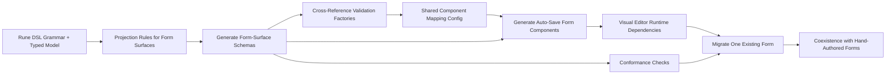

# Feature Specification: Adopt generated form surfaces and zod-form runtime

**Feature Branch**: `006-adopt-zod-to-form`
**Created**: 2026-02-27
**Status**: Draft
**Input**: User description: "Adopt langium-zod form-surface generation and enhanced @zod-to-form APIs in @rune-langium/visual-editor, including schema projection, component subpath exports, component config, scaffold updates, runtime dependency wiring, and initial EnumForm migration to the new form runtime."

## Clarifications

### Session 2026-02-28

- Q: How should external model updates (e.g. undo/redo) interact with in-progress dirty form state? → A: Pristine (unedited) fields refresh immediately; dirty (user-edited) fields are never overwritten by incoming external updates.
- Q: Which existing form is the designated first migration target for FR-013? → A: `EnumForm` — explicitly named as the first migration target.
- Q: How should the component reuse surface be exposed from the visual editor package? → A: Via a `package.json` `exports` map subpath (`"./components"`), importable as `@rune-langium/visual-editor/components`.
- Q: How should projection rules be authored? → A: TypeScript config file (e.g. `form-projection.config.ts`) — type-checked, colocated with the grammar workspace.
- Q: How should stale generated artifacts be detected when grammar, projection config, or mapping config changes? → A: Git diff CI check — CI regenerates artifacts and fails if committed files differ from freshly generated ones.

## User Scenarios & Testing *(mandatory)*

<!--
  IMPORTANT: User stories should be PRIORITIZED as user journeys ordered by importance.
  Each user story/journey must be INDEPENDENTLY TESTABLE - meaning if you implement just ONE of them,
  you should still have a viable MVP (Minimum Viable Product) that delivers value.

  Assign priorities (P1, P2, P3, etc.) to each story, where P1 is the most critical.
  Think of each story as a standalone slice of functionality that can be:
  - Developed independently
  - Tested independently
  - Deployed independently
  - Demonstrated to users independently
-->

### User Story 1 - Generate form-surface schemas from DSL sources (Priority: P1)

As a visual editor maintainer, I want form schemas generated directly from DSL definitions using projection and validation options so form inputs stay synchronized with model evolution.

**Why this priority**: Schema generation is the foundation for all downstream scaffolding and runtime behavior; if schema shape drifts, generated forms become unreliable.

**Independent Test**: Run schema generation from DSL definitions with the form projection config; verify generated schemas include only projected fields, include cross-reference validation factories, and pass conformance checks.

**Acceptance Scenarios**:

1. **Given** form-surface projection rules are defined, **When** schema generation runs, **Then** generated schemas include only the projected business fields and exclude internal framework metadata fields.
2. **Given** projected types include cross-references and constrained collections, **When** generation runs with validation options, **Then** cross-reference validation factories are produced and minimum cardinality constraints are preserved.
3. **Given** generated schemas and typed model definitions are present, **When** conformance checks run, **Then** type compatibility passes for unchanged grammar and fails when grammar/model drift is introduced.

---

### User Story 2 - Configure reusable form widgets (Priority: P1)

As a visual editor maintainer, I want a dedicated component export surface and shared configuration for custom field widgets so generated forms can consistently render domain-specific inputs without manual wiring per form.

**Why this priority**: Without this, generated forms cannot reliably map domain field types to reusable widgets, making the adoption path non-viable.

**Independent Test**: Create a config that references supported widget names and generate a form from a schema that includes mapped fields; verify mapped fields render custom widgets and unmapped fields use default inputs.

**Acceptance Scenarios**:

1. **Given** the visual editor package is installed, **When** a consumer resolves the components subpath, **Then** the widget module is resolvable for type-checking and runtime loading.
2. **Given** a field mapping config references valid widget names, **When** forms are generated and rendered, **Then** mapped fields use the configured widgets and invalid widget names are rejected during type-checking.

---

### User Story 3 - Generate auto-save form components (Priority: P1)

As a visual editor maintainer, I want form scaffolding to generate auto-save form components from generated form-surface schemas so output is immediately usable in editor workflows.

**Why this priority**: Generation output must align with editor save behavior and custom widget mappings; otherwise generated components require manual rework.

**Independent Test**: Run schema generation and form scaffolding end-to-end; verify generated outputs include auto-save behavior, no submit-button flow, and widget imports for mapped fields.

**Acceptance Scenarios**:

1. **Given** scaffold commands are configured with generated schemas and component mapping, **When** generation is executed, **Then** generated forms are produced without errors in the expected output location.
2. **Given** generated forms are reviewed, **When** a mapped domain field is present, **Then** output references the configured custom widget and does not render it as a plain text input.
3. **Given** generated forms are reviewed, **When** auto-save mode is enabled, **Then** output supports value-change callbacks and omits submit-button-driven flows.

---

### User Story 4 - Migrate one existing form safely (Priority: P2)

As a product engineer, I want one existing hand-authored form migrated to the new form runtime while preserving behavior so the team can validate coexistence and de-risk broader migration.

**Why this priority**: A single production-like migration validates integration patterns before rolling out to additional forms.

**Independent Test**: Replace one target form’s internal form engine with the generated/runtime approach and verify behavior parity for editing, auto-save timing, external updates, and list editing.

**Acceptance Scenarios**:

1. **Given** the migrated form is opened for an existing model element, **When** users edit supported fields, **Then** changes are persisted with the same observable behavior as before.
2. **Given** a user performs undo/redo or an external model update occurs, **When** the form is visible, **Then** form values refresh correctly without losing in-progress dirty edits.
3. **Given** non-migrated forms still exist, **When** users operate across migrated and non-migrated forms, **Then** both continue to function without regressions.

---

## End-to-End Pipeline

**Pipeline intent**:
- Keep form schemas synchronized with DSL evolution through generated form surfaces.
- Enforce schema/model contract alignment through conformance validation.
- Produce deterministic generated forms that are immediately usable with custom widgets.
- Validate migration safety by moving one form first and preserving coexistence.

### Inputs and Outputs by Stage

| Stage | Primary Inputs | Primary Outputs |
|---|---|---|
| Form-surface projection | Rune DSL grammar, typed model definitions, projection rules | Projected form-surface schema definitions |
| Schema validation layer | Projected schemas, cross-reference options | Cross-reference validation factory variants |
| Conformance verification | Generated schemas, typed model definitions | Pass/fail conformance signal for schema/model alignment |
| Component mapping | Widget export surface, field-type and field-path mapping rules | Validated component mapping configuration |
| Form scaffolding | Generated schemas, component mapping, auto-save mode | Deterministic generated form components |
| Runtime enablement | Generated forms, runtime dependencies, component module resolution | Executable runtime form rendering path |
| Incremental migration | Existing hand-authored form behavior, generated/runtime path | One migrated form with behavior parity and coexistence |

---

### Edge Cases

- Configuration references a widget name that is not exported by the component module.
- Projection config refers to fields that no longer exist in the grammar.
- Conformance checks fail after grammar updates, indicating schema/model drift.
- Cross-reference validation receives stale reference sets and rejects valid selections.
- Generated forms are stale because schema/config changed but scaffold was not re-run; detected by CI git-diff check failing on regeneration.
- External model changes (undo/redo or concurrent updates) occur while user has dirty form state.
- A field path expected to use a custom widget is omitted from field mappings.
- Runtime cannot resolve form runtime package at app build or execution time.

## Requirements *(mandatory)*

### Functional Requirements

- **FR-001**: The visual editor package MUST expose a dedicated components module via a `package.json` `exports` map subpath (`"./components"`), making reusable form widgets resolvable as `@rune-langium/visual-editor/components`.
- **FR-002**: The project MUST generate form-surface schemas from DSL sources using projection rules defined in a TypeScript config file (e.g. `form-projection.config.ts`) that restrict output to required form fields.
- **FR-003**: Generated form-surface schemas MUST exclude internal framework metadata fields.
- **FR-004**: Generated schemas MUST include cross-reference validation factory variants for types that contain cross-reference fields.
- **FR-005**: Generated schemas MUST include conformance checks against typed model definitions and fail validation on schema/model drift.
- **FR-006**: The components module MUST be consumable for both runtime imports and compile-time module-shape checking.
- **FR-007**: The project MUST define a central component mapping configuration that links domain field types and specific schema field paths to widget names.
- **FR-008**: The mapping configuration MUST reject invalid widget names during compile-time validation.
- **FR-009**: Form scaffold commands MUST consume generated schemas and the shared component mapping to generate form components.
- **FR-010**: Generated forms MUST support value-change-driven auto-save interaction and MUST NOT require submit-button interaction.
- **FR-011**: Generated output MUST render mapped domain fields with custom widgets and use default inputs for unmapped fields.
- **FR-012**: The visual editor package MUST include all runtime dependencies required by generated forms.
- **FR-013**: `EnumForm` MUST be migrated to the new form runtime while preserving current user-visible behavior; it is the designated first migration target.
- **FR-014**: The migrated form MUST preserve debounced auto-save behavior for core editable fields.
- **FR-015**: The migrated form MUST continue supporting list-style member editing within the shared form context.
- **FR-016**: The migrated form MUST handle external data refresh events by refreshing only pristine (unedited) fields; fields the user has actively edited MUST NOT be overwritten by incoming external updates, regardless of the update source.
- **FR-017**: Hand-authored non-migrated forms MUST continue to work unchanged during incremental rollout.
- **FR-018**: CI MUST regenerate all generated artifacts (schemas, conformance outputs, form components) and fail the build if any committed file differs from the freshly-regenerated output (`git diff --exit-code`).

### Constitution Alignment

- **CA-001**: Schema generation remains grammar-driven and typed, preserving alignment between DSL evolution and form-surface contracts.
- **CA-002**: Schema and scaffold outputs are deterministic artifacts regenerated from committed grammar/projection/config inputs.
- **CA-003**: Conformance and validation checks provide parity guardrails by failing on schema/model drift and invalid cross-reference values.
- **CA-004**: Auto-save and interaction responsiveness remain aligned with current editor expectations, including debounced update behavior.
- **CA-005**: The rollout is incremental and backward-compatible: migrated and hand-authored forms coexist until full migration is complete.

### Key Entities *(include if feature involves data)*

- **Component Module Surface**: Named widget exports available to config and generated forms; exposed via the `"./components"` `exports` map subpath as `@rune-langium/visual-editor/components`.
- **Form Projection Configuration**: Declarative TypeScript config file (e.g. `form-projection.config.ts`) that selects form-relevant fields per DSL type for generated schemas; type-checked at compile time alongside the grammar workspace.
- **Generated Form-Surface Schema Set**: Deterministic schema outputs and conformance artifacts derived from grammar and projection inputs.
- **Component Mapping Configuration**: Declarative mapping of domain field types and schema field paths to widget names and optional widget props.
- **Generated Form Artifact**: Checked-in deterministic form component output produced from schema and mapping inputs.
- **Migrated Form Instance**: `EnumForm` — the existing hand-authored editor form designated as the first migration target; moved to the new runtime while retaining established behavior.
- **External Data Sync State**: Mechanism for reconciling upstream model changes with local form edits.

## Success Criteria *(mandatory)*

### Measurable Outcomes

- **SC-001**: 100% of configured custom widget field mappings resolve successfully during form generation and runtime loading in validation runs.
- **SC-002**: Schema-generation runs produce projected form-surface outputs and conformance artifacts successfully in one pass with no manual file edits.
- **SC-003**: Conformance checks fail reliably when an intentional grammar/model mismatch is introduced and pass again after alignment is restored.
- **SC-004**: Running the scaffold command produces all targeted generated forms successfully in a single run with zero manual post-generation edits required.
- **SC-005**: In migrated-form verification scenarios, 100% of tested name/parent edits are persisted through auto-save within the existing debounce window.
- **SC-006**: In migrated-form verification scenarios, 100% of tested external update events (including undo/redo) reconcile by updating pristine fields and leaving dirty fields untouched; no dirty field value is overwritten by an incoming external update.
- **SC-007**: No regressions are introduced in non-migrated forms during the migration release, as validated by existing form-focused test coverage and smoke checks.
- **SC-008**: CI regeneration check (`git diff --exit-code` after full generation) passes with zero diff on a clean checkout where all inputs and outputs are in sync; fails with a non-zero exit when any generated file is intentionally drifted from its inputs.

## Assumptions

- The enhanced form-generation and runtime capabilities described in the upstream prerequisite are available and stable for consumption.
- Grammar-derived typed model artifacts required for conformance checks are available in the visual editor workspace.
- Existing hand-authored forms remain in scope and are not replaced wholesale in this feature.
- Incremental migration starts with a single form target to establish a repeatable pattern before broader rollout.
- Generated schema and form artifacts remain committed outputs and are regenerated whenever grammar, projection, or mapping inputs change.
