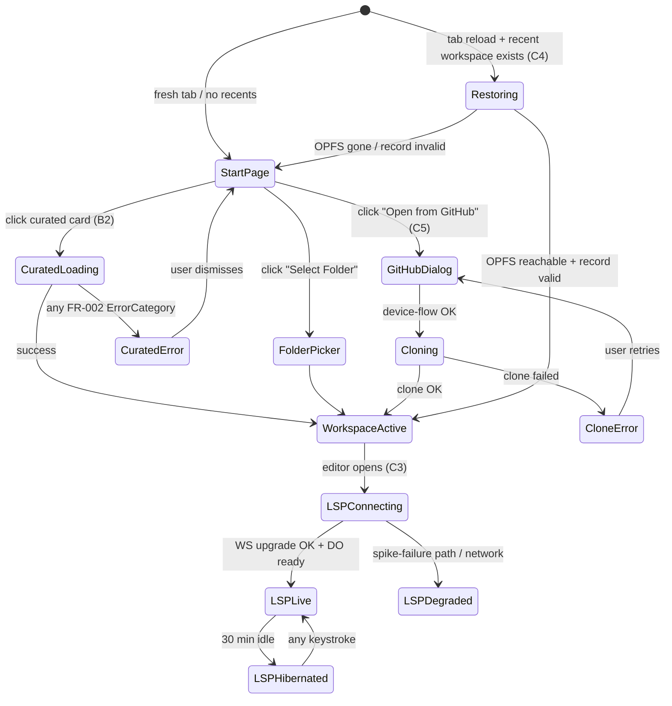

# Data Model: Studio Production Readiness

**Feature**: `014-studio-prod-ready`
**Phase**: 1 (Design)
**Date**: 2026-04-25

This feature adds **two new entities** and **modifies one existing
entity**. Most of the existing 012 data model is unchanged — workspace
records, telemetry events, curated manifests are all carried forward.

---

## §1 — RuneLspSession (new — Durable Object)

A long-lived per-workspace LSP session held in a Cloudflare Durable
Object. Holds the langium service instance, the parsed workspace
state, and the WebSocket the client is connected over.

**Identity**: keyed by `<sessionToken>:<workspaceId>` so two tabs on
the same workspace get the same DO (which the existing multi-tab
broadcast layer can then arbitrate). The session token is minted
when the studio first opens an LSP connection; it's tied to the tab
+ origin + a server-issued nonce.

**Storage** (under DO `state.storage`):

| Key | Type | Description |
|---|---|---|
| `meta` | `{ workspaceId, createdAt, lastActiveAt, originHash }` | Tracking + idle-eviction metadata |
| `docs:<uri>` | `string` | Source content for each open document; mirrors what the client sent via `textDocument/didOpen` |
| `state-hash` | `string` | sha256 of (sorted doc URIs + their content hashes) — used to detect "client says reconnected, server sees no state mismatch" |

**In-memory** (DO instance fields, not persisted across hibernation):

| Field | Type | Description |
|---|---|---|
| `langium` | `LangiumServices` | The langium service container; constructed lazily on first message |
| `ws` | `WebSocket \| null` | The connected client's WS; null while hibernating |
| `pendingChanges` | `Map<uri, debouncedHandle>` | Coalesces `didChange` notifications |

**Lifecycle**:

1. **Hibernating**: no in-memory state; storage holds the persisted view.
2. **Active** (after `acceptWebSocket()`): `langium` constructed, all `docs:*` keys hydrated into `LangiumDocument`s, ready for messages.
3. **Idle eviction**: after 30 min with no message + WS hibernated, the DO is GC-eligible. CF reaps it; next connect rebuilds.
4. **Hard reset**: a `notifications/reset` message clears all `docs:*` keys; client must re-`didOpen` everything.

**Validation rules**:
- `originHash` MUST match `sha256(req.headers.Origin + DAILY_SALT)`. Mismatched origin = 403, no DO action.
- A `textDocument/didOpen` for a URI that already exists MUST replace, not duplicate.
- `state.storage.put('docs:*', ...)` calls are batched within `blockConcurrencyWhile()` to match the existing TelemetryAggregator pattern.

**Relationships**: Independent. Does not reference `WorkspaceRecord` directly — workspaceId is opaque to the DO.

---

## §2 — LSP Session Token (new — short-lived nonce)

A token a client presents on the WS upgrade so the LSP worker can
route to the right DO and validate the upgrade. Not persisted
server-side beyond a per-day nonce-consumption set; lives client-side
in IndexedDB next to the workspace metadata.

**Shape** (server's view):

```
type SessionToken = {
  v: 1;                           // schema version
  workspaceId: string;            // opaque ULID
  issuedAt: number;               // ms epoch
  exp: number;                    // ms epoch; default issuedAt + 24h
  origin: string;                 // expected request Origin
  nonce: string;                  // 16 random bytes hex
};
// Wire format: base64url(JSON) signed with HMAC-SHA256(SESSION_SIGNING_KEY)
```

**Issuance**: a new endpoint `POST /rune-studio/api/lsp/session` takes
`{workspaceId}` from a same-origin POST (Origin allowlist enforced),
mints a token, and returns it. Mirrors the existing codegen-worker
session pattern.

**Persistence (client-side)**: IndexedDB store `lsp-sessions`, keyed
by `workspaceId`, holds the latest valid token. Reused on reconnect
until expiry. Refresh on 401 from the WS upgrade.

**Validation rules**:
- Signature MUST verify with `SESSION_SIGNING_KEY` (a CF Worker secret).
- `exp` MUST be in the future.
- `origin` MUST match the upgrade request's `Origin` header.
- `nonce` MUST NOT have been seen on any other DO in the past 24h
  (replay protection — the LSP worker checks against a small
  in-memory ring buffer per isolate, accepting collisions across
  isolates as low-risk for a 24h-bound short-lived token).

---

## §3 — DesignToken tree (modified)

The existing `packages/design-tokens/src/tokens.json` is extended.
Net new top-level keys:

| Key path | Type | Why added |
|---|---|---|
| `font.display` | `string` (font-family stack) | FR-022 — single source of truth for the body/heading font |
| `font.mono` | `string` | Same, for code blocks |
| `space.1` … `space.10` | `string` (e.g. `"4px"`, `"8px"`, …, `"40px"`) | FR-025 — closes the undefined-property regression |
| `text.md` | `string` (e.g. `"0.9375rem"`) | FR-025 |
| `sidebar.width.default` / `min` / `max` | `string` | FR-025 |
| `syntax.keyword` / `string` / `comment` / `function` / `operator` / `constant` / `variable` | `string` (hex colour) | Lift the seven-token palette out of three-place duplication |
| `radius.md` | `string` (e.g. `"8px"`) | FR-024 — canonical primary-button radius |
| `button.height` | `string` (e.g. `"40px"`) | FR-024 |
| `focus.ring.width` / `offset` / `colour` | `string` | FR-026 — single focus-ring spec |
| `brand.mark.size` / `radius` / `border-width` | `string` | FR-029 — landing + Studio mark identical |

**Build outputs** (existing build extended):
- `dist/tokens.css` — `:root { --foo: ... }` + `[data-theme="dark"]` overrides (already emitted, gains the new keys).
- `dist/tokens.js` — `as const` JS export (already emitted).
- `dist/tokens.d.ts` — fully-typed `Tokens` interface (already emitted; gains new keys automatically via the existing emitDts walker).
- `dist/brand.css` (NEW) — a tiny `:root` block emitting the brand subset (font, palette, syntax, radius, focus-ring, brand-mark) for the landing site and the docs theme to `<link>` / `import`.

**Validation**: existing snapshot test in
`packages/design-tokens/tests/build.test.ts` is extended to assert
the new variable families are present in `tokens.css` and the
typed `Tokens` interface contains the new key paths.

---

## §4 — Carried-forward entities (no schema change)

| Entity | File | What stays the same |
|---|---|---|
| `WorkspaceRecord` | `apps/studio/src/workspace/persistence.ts` | All four kinds + the `DockviewPayload` tagged union. The C4 fix only changes *when* `loadWorkspace()` runs (mount-time, not just on click), not the record shape. |
| `CuratedManifest` | `packages/curated-schema/src/index.ts` | Single source of truth; the only change in 014 is that the manifest is now actually fetched (B2) instead of bypassed. |
| `TelemetryEvent` | `apps/telemetry-worker/src/index.ts` | Closed schema, daily salt, IP-hash — all preserved (FR-017). |
| `PanelLayoutRecord` | `apps/studio/src/workspace/persistence.ts` | Tagged union (factory / native) preserved. |

---

## §5 — State transitions



Three transition gates are this feature's load-bearing diffs:
1. **`[*] → Restoring`** (C4) — the App.tsx mount-time check.
2. **`StartPage → CuratedLoading`** (B2) — `archiveLoader` wired.
3. **`WorkspaceActive → LSPConnecting`** (C3) — replaces today's
   immediate-`LSPDegraded` trap with a real connect attempt.
